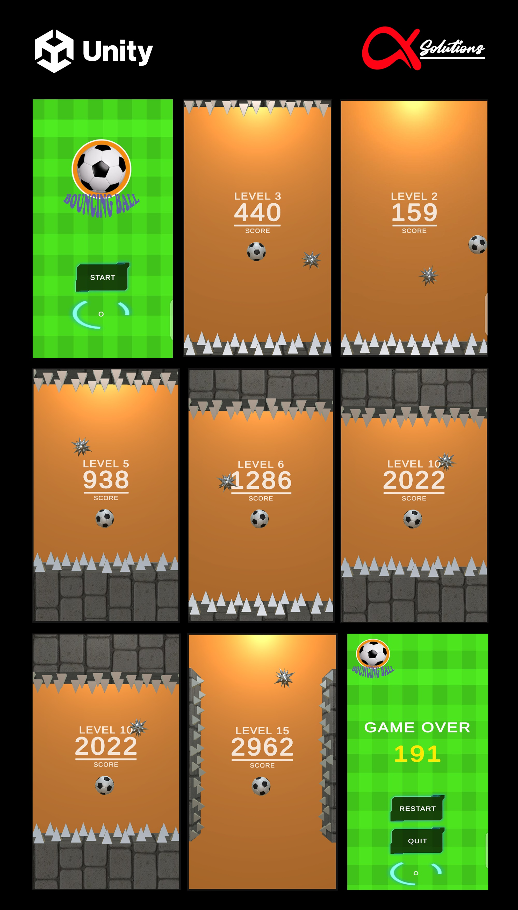

# Bouncing Ball (Andriod & iOS)

  Bouncing Ball Unity C# Game: 

  **Bouncing Ball** is a Unity 3D endless-level game where players must keep a ball safe from sharp obstacles by tapping the screen. Each tap makes the ball bounce and changes its direction, requiring precise timing and quick reflexes to avoid punctures. As the game progresses, the difficulty increases, with faster-moving obstacles, making it a challenging and engaging experience for players of all ages. Designed with simple mechanics and smooth gameplay, Bouncing Ball offers endless fun while testing players' hand-eye coordination and reaction speed.

  **Skills and deliverables**

  Unity   C#    Game Development   Android App    Google Play  

  