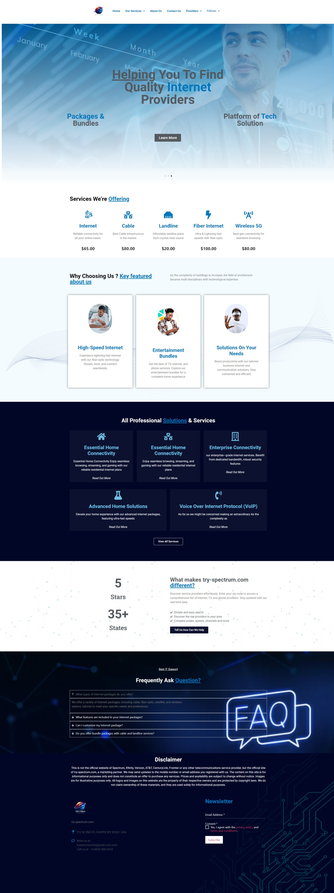

# Try Spectrum

  Try Spectrum (Telecommunication): [visit website](https://try-spectrum.com/)

  My role: WordPress Developer

  Project description:
  **Try Spectrum** is a custom WordPress website developed for a Nigerian client specializing in pension management and retirement solutions. The project involved theme development, custom PHP coding, and design-to-code conversion, ensuring a seamless and user-friendly experience. The website effectively supports users in managing and processing their pensions while providing valuable retirement planning tools.

  **Skills and deliverables**

  | Theme Development | Custom PHP | Custom Web Design | Design-to-Code | Custom Theme Development |
  |-------------------|------------|-------------------|----------------|--------------------------|

  
  

  
    
